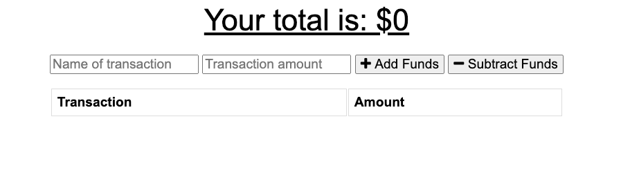

# Progressive-Budget

## Description

  Welcome to the new Online/Offline Budget Tracker! This budget app makes it simple. A user will be able to add expenses and deposits to their budget with or without a connection. When entering transactions offline, they will populate the total when brought back online. This tracker is a Progressive Web Application (PWA) using IndexDB. We hope you enjoy the app for your daily needs!

  

  ## Table of Contents
  
  - [Installation](#installation)
  - [Testing](#tests)
  - [Usage](#usage)
  - [License](#license)
  - [Contributors](#contributors)
  - [Link to Deployed Application](#link)
  - [Questions](#questions)

  ## Installation

  - Run Command: npm install
  - Start Command: node server.js

  ## Tests
  
  - Run Command: None

  ## Usage

  - This application is a PWA using IndexDB. Please see installation instructions and tests for more information.

  ## License

  

  ## Contributors

  - None

  ## Link

  - 

  ## Questions? 
  
  - Feel free to contact me at ksmera01@gmail.com